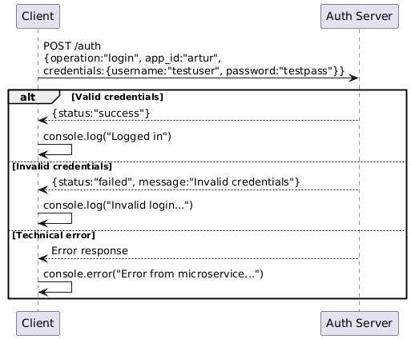

# Authentication Microservice

# Communication Contract

# Requesting Data (API Specification)

To request for authentication, make a POST request to the `/auth` with json data.

**Endpoint**: 
`POST /auth`

**Headers**:
Content-Type: application/json

**Body**:
{
  "operation": "login",
  "app_id": "your_app_id",
  "credentials": {
    "username": "your_username",
    "password": "your_password"
  }
}

**Example Request (JavaScript)**:
```javascript
const axios = require('axios');

const authPayload = {
  operation: "login",
  app_id: "artur",
  credentials: {
    username: "testuser",
    password: "testpass"
  }
};

axios.post('http://localhost:3001/auth', authPayload)
  .then(response => {
    console.log("Authentication Response:", response.data);
  })
  .catch(error => {
    console.error("Error:", error.response?.data || error.message);
  });
```

# Response Handling
JSON will be returned with an example of the response body being:

{
  "status": "failed",
  "message": "Invalid credentials"
}

# Example of succesfully receiving data
Successful Authentication (200 OK)
Headers:

Content-Type: application/json

Response Body:

{
  "status": "success",
  "message": "Authentication successful",
  "token": "generated_jwt_token" // Optional, if using JWT
}

# UML diagram


